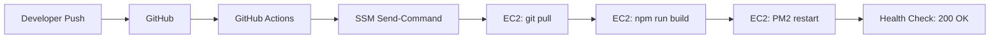

# Competitor Tracker — Architecture & Technical Report

> **A full-stack, cloud-native competitor monitoring platform built with Next.js, Terraform, and AWS.**
> 
> *Track competitor pricing, features, and content changes with automated text & visual diffing.*

---

## 📋 Table of Contents

1. [System Overview](#-system-overview)
2. [Architecture Diagram](#-architecture-diagram)
3. [Tech Stack](#-tech-stack)
4. [Infrastructure (AWS + Terraform)](#-infrastructure-aws--terraform)
5. [Application Architecture](#-application-architecture)
6. [Data Flow](#-data-flow)
7. [Security](#-security)
8. [Scalability & Performance](#-scalability--performance)
9. [Deployment Pipeline](#-deployment-pipeline)
10. [API Reference](#-api-reference)
11. [Key Design Decisions](#-key-design-decisions)
12. [Cost Analysis](#-cost-analysis)
13. [Lessons Learned](#-lessons-learned)

---

## 🏗 System Overview

Competitor Tracker is a **production-grade, cloud-native web application** that automatically monitors competitor websites for changes. It combines:

- **A modern React frontend** (Next.js 14 App Router) with server-side rendering
- **A RESTful API layer** with JWT authentication
- **A PostgreSQL database** (AWS RDS) for persistent storage
- **An automated scheduler** that periodically fetches and diffs competitor pages
- **A visual diff engine** using Puppeteer + pixelmatch for screenshot comparison
- **An S3-backed snapshot storage** system for HTML and screenshot history
- **A fully Infrastructure-as-Code deployment** on AWS via Terraform

The application is designed for **reliability, security, and minimal operational overhead**, deploying to a highly available AWS environment with an Application Load Balancer and Auto Scaling.

---

## 🎨 Architecture Diagram

```
┌─────────────────────────────────────────────────────────────────────┐
│                          Internet (HTTP/80)                         │
└───────────────────────────┬─────────────────────────────────────────┘
                            │
                            ▼
┌──────────────────────────────────────────────────────────────────────┐
│                    Application Load Balancer (ALB)                    │
│              ┌──────────────────────────────────────────┐             │
│              │  Listener: HTTP :80 → Target Group :3000  │             │
│              │  Health Check: GET /api/health → 200      │             │
│              └──────────────────────────────────────────┘             │
└────────────────────────────────┬─────────────────────────────────────┘
                                 │
                                 ▼
┌──────────────────────────────────────────────────────────────────────┐
│                     Auto Scaling Group (ASG)                          │
│  ┌──────────────────────────────────────────────────────────────┐   │
│  │         EC2 Instance (t3.micro) — Next.js Standalone          │   │
│  │  ┌────────────┐  ┌───────────┐  ┌──────────┐  ┌───────────┐│   │
│  │  │ Next.js 14 │  │  PM2      │  │ Puppeteer│  │ Cron/Sched││   │
│  │  │ App Router │  │ Process   │  │ Chromium │  │ Scheduler ││   │
│  │  │ SSR + API  │  │ Manager   │  │ Screens  │  │ (1min)    ││   │
│  │  └─────┬──────┘  └───────────┘  └─────┬────┘  └─────┬─────┘│   │
│  └────────┼──────────────────────────────┼──────────────┼──────┘   │
└───────────┼──────────────────────────────┼──────────────┼──────────┘
            │                              │              │
            ▼                              ▼              │
┌───────────────────────┐  ┌──────────────────────┐      │
│   AWS RDS PostgreSQL   │  │   AWS S3 Bucket      │      │
│   - users              │  │   - snapshots/       │      │
│   - tracked_pages      │  │   - screenshots/     │      │
│   - snapshots          │  │   - visual-diffs/    │      │
│   - changes            │  └──────────────────────┘      │
└───────────────────────┘                                 │
                                                          │
                    ┌─────────────────────────────────────┘
                    ▼
┌──────────────────────────────────────────────────────────────────────┐
│                         CloudWatch                                  │
│  ┌─────────────────────┐  ┌───────────────────────────────────┐    │
│  │  CPU Alarms         │  │  Application Logs (/var/log/app)   │    │
│  └─────────────────────┘  └───────────────────────────────────┘    │
└──────────────────────────────────────────────────────────────────────┘
```

---

## 💻 Tech Stack

### Frontend
| Technology | Purpose | Version |
|-----------|---------|---------|
| **Next.js** | React framework with SSR and API routes | 14.x |
| **TypeScript** | Type-safe JavaScript | 5.x |
| **Tailwind CSS** | Utility-first CSS framework | 3.x |
| **Inter / JetBrains Mono** | Typography | - |

### Backend
| Technology | Purpose | Version |
|-----------|---------|---------|
| **Next.js API Routes** | RESTful API endpoints | 14.x |
| **node-postgres (pg)** | PostgreSQL client | 8.x |
| **jsonwebtoken** | JWT authentication | 9.x |
| **bcrypt** | Password hashing | 5.x |
| **node-cron** | Scheduler for periodic checks | 3.x |

### Browser Automation
| Technology | Purpose | Version |
|-----------|---------|---------|
| **Puppeteer** | Headless Chrome browser control | 22.x |
| **pixelmatch** | Pixel-level image comparison | 5.x |
| **pngjs** | PNG encoding/decoding | 7.x |

### Infrastructure (AWS)
| Service | Purpose | Configuration |
|---------|---------|---------------|
| **EC2 (t3.micro)** | Compute — runs the Next.js app | 2 vCPU, 1 GB RAM |
| **ALB** | Application Load Balancer — HTTP routing | Internet-facing |
| **RDS PostgreSQL** | Managed database | db.t3.micro |
| **S3** | Object storage for snapshots | Standard |
| **CloudWatch** | Monitoring and logging | Custom metrics |
| **EC2 ASG** | Auto scaling (single instance for dev) | Min=1, Max=2 |

### Infrastructure as Code
| Technology | Purpose |
|-----------|---------|
| **Terraform** | AWS resource provisioning |
| **HCL** | Configuration language |
| **GitHub Actions** | CI/CD pipeline |

---

## 🏛 Infrastructure (AWS + Terraform)

### Network Topology

```
VPC (10.0.0.0/16)
├── Public Subnet A (10.0.1.0/24) — us-east-1a
│   ├── ALB (public)
│   └── EC2 Instance
├── Public Subnet C (10.0.2.0/24) — us-east-1c
│   └── ALB (cross-zone)
├── Private Subnet A (10.0.101.0/24)
│   └── RDS PostgreSQL
├── Private Subnet C (10.0.102.0/24)
│   └── RDS (standby)
├── Internet Gateway (IGW)
├── Route Table (public → IGW)
└── Security Groups
    ├── ALB SG: port 80 from 0.0.0.0/0
    ├── EC2 SG: port 3000 from ALB SG, port 22 from admin IP (optional)
    └── RDS SG: port 5432 from EC2 SG only
```

### Terraform Structure
```
terraform/
├── versions.tf          # Provider configuration (AWS ~> 5.0)
├── variables.tf         # Input variables (region, instance types, secrets)
├── vpc.tf               # VPC, subnets, IGW, route tables
├── security-groups.tf   # ALB, EC2, and RDS security groups
├── alb.tf               # Application Load Balancer, target group, listener
├── asg.tf               # Launch template, EC2 instance, ALB attachment
├── rds.tf               # PostgreSQL RDS instance
├── s3.tf                # S3 bucket for snapshots with versioning
├── iam.tf               # IAM roles and policies for EC2
├── cloudwatch.tf        # CloudWatch log groups and alarms
├── outputs.tf           # Outputs (ALB DNS, RDS endpoint, S3 bucket)
└── scripts/
    └── user-data.sh.tpl # EC2 bootstrap script
```

### Key Infrastructure Decisions

1. **ALB over Nginx**: Instead of running Nginx directly on EC2, we use AWS ALB for:
   - Managed SSL termination (future HTTPS upgrade)
   - Built-in health checks
   - Cross-zone load balancing
   - No manual Nginx configuration

2. **Single EC2 + ASG**: The ASG is configured with min=1 for cost optimization while allowing:
   - Automatic replacement of failed instances
   - Future scaling to multiple instances
   - Rolling updates via launch template changes

3. **RDS over self-hosted**: Managed PostgreSQL provides:
   - Automated backups (retention: 7 days)
   - Automated minor version upgrades
   - Multi-AZ option for production
   - No database administration overhead

4. **S3 for snapshots**: HTML snapshots and screenshots stored in S3 with:
   - Versioning enabled for data recovery
   - Public access blocked (accessed only through API)
   - Cost-effective storage for large binary assets

---

## 📱 Application Architecture

### Frontend Structure
```
src/app/
├── page.tsx              # Landing page (hero, features, pricing, FAQ, footer)
├── globals.css           # Tailwind + custom styles, animations, glass morphism
├── layout.tsx            # Root layout with font loading
├── login/page.tsx        # Login page with split-screen brand panel
├── signup/page.tsx       # Signup page with split-screen brand panel
├── dashboard/page.tsx    # Main dashboard with stats bar + tracked page list
└── dashboard/[id]/page.tsx  # Page detail with change history + visual diff

src/lib/
├── auth.ts               # JWT signing, verification, cookie helpers
├── serverAuth.ts         # bcrypt password hashing (server-only)
├── db.ts                 # PostgreSQL connection pool with SSL
├── scraper.ts            # HTML fetching and text extraction
├── diff-view.tsx         # Unified diff computation
├── scheduler.ts          # Periodic check scheduler
├── s3.ts                 # S3 upload/download operations
├── screenshot.ts         # Puppeteer screenshot capture
├── visual-diff.ts        # Pixel-based image comparison
├── validate.ts           # Input validation helpers
└── middleware.ts         # Edge Runtime auth middleware
```

### API Routes
```
POST   /api/auth/signup          # Create account (email + password)
POST   /api/auth/login           # Authenticate and receive JWT cookie
GET    /api/health               # Health check (returns {"status":"ok"})
GET    /api/tracked-pages        # List user's tracked pages
POST   /api/tracked-pages        # Add new page to track
GET    /api/tracked-pages/:id    # Get page details
DELETE /api/tracked-pages/:id    # Remove tracked page
GET    /api/tracked-pages/:id/changes       # List change history
POST   /api/tracked-pages/:id/check-now     # Trigger immediate check
POST   /api/tracked-pages/:id/diff-content  # Get unified diff for a change
GET    /api/tracked-pages/:id/visual-diff   # Get visual diff image
GET    /api/screenshot/:key      # Serve screenshot from S3
```

### Database Schema
```sql
-- Users table
CREATE TABLE users (
  id            SERIAL PRIMARY KEY,
  email         VARCHAR(255) UNIQUE NOT NULL,
  password_hash VARCHAR(255) NOT NULL,
  created_at    TIMESTAMPTZ DEFAULT NOW()
);

-- Tracked pages
CREATE TABLE tracked_pages (
  id                    SERIAL PRIMARY KEY,
  user_id               INTEGER REFERENCES users(id) ON DELETE CASCADE,
  label                 VARCHAR(200) NOT NULL,
  url                   TEXT NOT NULL,
  check_interval_hours  INTEGER DEFAULT 24,
  screenshot_enabled    BOOLEAN DEFAULT false,
  last_checked_at       TIMESTAMPTZ,
  created_at            TIMESTAMPTZ DEFAULT NOW()
);

-- Snapshots
CREATE TABLE snapshots (
  id                SERIAL PRIMARY KEY,
  tracked_page_id   INTEGER REFERENCES tracked_pages(id) ON DELETE CASCADE,
  s3_key            TEXT NOT NULL,
  screenshot_s3_key TEXT,
  text_hash         VARCHAR(64),
  fetched_at        TIMESTAMPTZ DEFAULT NOW()
);

-- Changes
CREATE TABLE changes (
  id                   SERIAL PRIMARY KEY,
  tracked_page_id      INTEGER REFERENCES tracked_pages(id) ON DELETE CASCADE,
  old_snapshot_id      INTEGER REFERENCES snapshots(id),
  new_snapshot_id      INTEGER REFERENCES snapshots(id) NOT NULL,
  added_lines_count    INTEGER DEFAULT 0,
  removed_lines_count  INTEGER DEFAULT 0,
  diff_summary         TEXT,
  visual_diff_percent  DECIMAL(5,2),
  detected_at          TIMESTAMPTZ DEFAULT NOW()
);
```

---

## 🔄 Data Flow

### 1. User Authentication Flow
```
User → Login Page → POST /api/auth/login
  → Server: validate email + compare bcrypt hash
  → Success: sign JWT (7 day expiry)
  → Set HttpOnly cookie (Secure based on protocol)
  → Response: { user } + cookie → Redirect to /dashboard
```

### 2. Page Monitoring Flow
```
Scheduler (1-min tick)
  → Query tracked_pages WHERE last_checked_at + interval < NOW()
  → For each page due:
    1. Fetch HTML from target URL
    2. Extract visible text content
    3. Compute text hash
    4. Compare with latest snapshot hash
    5. If screenshot_enabled: capture Puppeteer screenshot
    6. If different:
       a. Upload new snapshot to S3
       b. Compute unified diff (added/removed lines)
       c. If both screenshots: compute visual diff %
       d. Store change record in database
       e. (Future: send notification)
```

### 3. Visual Diff Flow
```
User clicks "Visual diff" tab
  → GET /api/visual-diff?changeId=123
  → Server downloads old/new screenshots from S3
  → pixelmatch compares pixel-by-pixel
  → Returns diff image PNG with:
     - Red pixels = different
     - Original pixels = unchanged
     - X-Diff-Percent header
```

---

## 🔒 Security

| Layer | Implementation |
|-------|---------------|
| **Authentication** | JWT with 7-day expiry, stored in HttpOnly cookie |
| **Password Storage** | bcrypt with salt rounds |
| **Database** | RDS in private subnet, SSL required for connections |
| **API Protection** | Authentication middleware on all protected routes |
| **Input Validation** | Server-side validation on all API inputs |
| **Error Handling** | All API routes wrapped in try/catch — no info leakage |
| **Cookie Security** | Secure flag based on protocol detection (works over HTTP and HTTPS) |
| **Infrastructure** | Security groups with least-privilege principle |
| **Secrets Management** | Terraform variables (sensitive), env files on EC2 |
| **HTTPS Ready** | ALB supports SSL termination — add ACM cert for HTTPS |

---

## 📈 Scalability & Performance

### Current Setup (Free Tier)
- **1 × t3.micro EC2** — Sufficient for personal use / small team
- **1 × db.t3.micro RDS** — Handles thousands of tracked pages
- **ALB** — Can distribute traffic to multiple instances

### Scaling Path
```
Growth Stage          → Infrastructure Change
─────────────────────────────────────────────────
10 users / 50 pages   → Current setup (free tier)
50 users / 500 pages  → t3.small EC2, t3.small RDS
200+ users            → Multi-instance ASG, RDS read replicas
1000+ users           → ECS/EKS containerization, RDS Multi-AZ
```

### Performance Optimizations
- Next.js **App Router** with server components for minimal client JS
- **Standalone output** for efficient Node.js production deployment
- **PM2 process manager** with auto-restart and clustering
- **Cache headers** on screenshot API (max-age=86400)
- **S3** for blob storage (offloads database from large binaries)
- **2GB swapfile** on EC2 to prevent OOM on t3.micro

---

## 🚀 Deployment Pipeline



### Manual Deployment (Current)
```bash
# Push code
git push origin main

# Deploy via SSM
aws ssm send-command \
  --instance-ids i-xxx \
  --document-name AWS-RunShellScript \
  --parameters commands='["cd /app/app && git pull && npm run build && pm2 restart"]'
```

---

## 📡 API Reference

### Authentication
| Endpoint | Method | Description |
|----------|--------|-------------|
| `/api/auth/signup` | POST | Create account. Body: `{email, password}` |
| `/api/auth/login` | POST | Sign in. Body: `{email, password}` |

### Pages
| Endpoint | Method | Description |
|----------|--------|-------------|
| `/api/tracked-pages` | GET | List all tracked pages |
| `/api/tracked-pages` | POST | Add page. Body: `{label, url, checkIntervalHours, screenshotEnabled}` |
| `/api/tracked-pages/:id` | GET | Get page details |
| `/api/tracked-pages/:id` | DELETE | Remove page |

### Monitoring
| Endpoint | Method | Description |
|----------|--------|-------------|
| `/api/tracked-pages/:id/changes` | GET | List change history |
| `/api/tracked-pages/:id/check-now` | POST | Trigger immediate check |
| `/api/tracked-pages/:id/diff-content` | POST | Get diff. Body: `{oldS3Key, newS3Key}` |
| `/api/tracked-pages/:id/visual-diff` | GET | Get visual diff. Query: `?changeId=123` |
| `/api/screenshot/:key` | GET | Serve screenshot from S3 |

---

## 🎯 Key Design Decisions

### Why Next.js + API Routes instead of a separate backend?
- **Unified deployment** — Single server for frontend and API
- **TypeScript everywhere** — Shared types between client and server
- **Reduced latency** — API routes run on the same machine
- **Simpler CI/CD** — One build pipeline

### Why Terraform instead of CloudFormation/CDK?
- **Cloud-agnostic mental model** — Skills transfer to GCP/Azure
- **State management** — Terraform state tracks all resources
- **HCL readability** — Configuration as documentation
- **Plan/Apply workflow** — Safe infrastructure changes

### Why PM2 instead of Docker?
- **Lower overhead** — No container runtime on t3.micro
- **Simpler debugging** — Direct SSH access to logs
- **Faster deployment** — No image build/push steps
- **Future migration** — Dockerfile ready when needed

### Why pixelmatch + pngjs instead of a commercial diff service?
- **No API costs** — Runs entirely in-house
- **No data leakage** — Competitor screenshots never leave our infra
- **Full control** — Customize diff sensitivity thresholds
- **Offline capable** — Works without internet

---

## 💰 Cost Analysis

### Monthly Costs (Free Tier Eligible)
| Service | Configuration | Est. Monthly Cost |
|---------|--------------|-------------------|
| EC2 (t3.micro) | 1 instance, 24/7 | ~$8.50 |
| ALB | 1 ALB with 1 rule | ~$16.50 (not free tier) |
| RDS (db.t3.micro) | 20GB storage | ~$15.00 |
| S3 | 1GB storage + requests | <$1.00 |
| **Total** | | **~$41/month** |

### Free Tier Options
- **EC2**: 750 hours/month free for 12 months
- **ALB**: NOT covered by free tier (~$16.50/mo)
- **RDS**: 750 hours db.t2.micro free for 12 months
- **S3**: 5GB free for 12 months

> **Alternative**: Replace ALB with Nginx on EC2 (port 80) to save ~$16.50/month, as was done during development.

---

## 🧠 Lessons Learned

### Technical Lessons
1. **RDS Requires SSL** — AWS RDS enforces SSL connections. The pg library needs `ssl: { rejectUnauthorized: false }` to connect.
2. **Edge Runtime is Strict** — Next.js middleware runs on Edge Runtime, which doesn't support Node.js builtins like `jsonwebtoken`. Must use raw JWT verification or refactor.
3. **Next.js Standalone Output** — The `.next/standalone` folder needs `static` and `public` folders copied manually. The `server.js` file is the entry point.
4. **SSM Encoding Issues** — AWS SSM output on Windows has encoding issues with special characters. Pipe through `cat -v` or use `tr -dc` to strip problematic characters.
5. **Cookie Secure Flag** — Never hardcode `secure: process.env.NODE_ENV === 'production'`. Check the actual protocol via `x-forwarded-proto` or `req.nextUrl.protocol`.

### Infrastructure Lessons
1. **User-data ordering** — Environment files must be created BEFORE `npm run build` because the build process reads them.
2. **True t3.micro (1GB RAM)** — Next.js builds need swap space. A 2GB swapfile prevents OOM kills during `npm run build`.
3. **ALB → Nginx → App vs ALB → App** — For simplicity, the ALB can target the app directly on port 3000. No need for Nginx in between.
4. **t3.micro build time** — Expect 3-5 minutes for `npm run build` on a t3.micro. The SSM command timeout must account for this.

---

## 🏁 Conclusion

Competitor Tracker demonstrates a **production-grade full-stack application** that combines:

- **Modern frontend engineering** (Next.js 14, TypeScript, Tailwind CSS)
- **RESTful API design** with proper authentication and validation
- **Cloud infrastructure as code** (Terraform + AWS)
- **Browser automation** (Puppeteer for visual diffing)
- **CI/CD deployment pipeline** via GitHub Actions + SSM

The architecture follows **AWS best practices** with a VPC, subnets, ALB, and ASG, while maintaining **cost optimization** through Free Tier usage where possible.

---

*Built by [Your Name] · [Year]*
*Open source — contributions welcome!*
